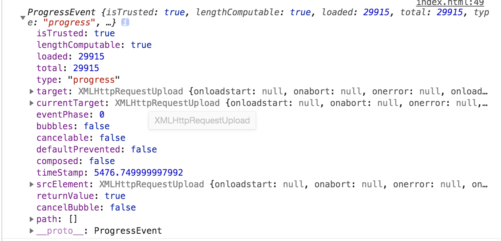

# ajax上传，无需刷新页面，展示上传进度


### 相关方法和变量

- xhr.onprogress/xhr.upload.onprogress 监听上传进度的函数

- event.lengthComputable 一个状态，代表`发送长度`发生改变

- event.loaded 表示已经上传了多少`字节`

- event.total 表示需要上传的文件总共有多少字节



注意⚠️:

`xhr.upload.onprogress`要写在`xhr.send`方法前面，否则`event.lengthComputable`状态不会改变，只有在最后一次才能获得，也就是100%的时候.

### 客户端

```html
<!DOCTYPE html>
<html lang="en">
<head>
    <meta charset="UTF-8">
    <title>文件上传 显示上传进度</title>
    <style>

    </style>
</head>
<body>
<div class="upload-wrapper">
    <input id="demo5Progress" type="file" multiple>
    <br>
    <div class="upload-progress">
        上传进度：
        <div class="progress-status"></div>
    </div>
    <button id="btn-submit">提交</button>
</div>
<script>
    const btn = document.getElementById('btn-submit'),
        getEl = el => document.querySelector(el)

    function handleUpload() {
        const inputEl = getEl('#demo5Progress'),
            progressEl = getEl('.progress-status'),
            files = inputEl.files
        progressEl.style.cssText = 'width: 0'
        if (!files.length) {
            return alert('请选择文件')
        }
        const formatData = new FormData()
        for (let i = 0; i < files.length; i++) {
            formatData.append('demo5Progress', files[i])
        }
        const xhr = new XMLHttpRequest()
        xhr.open('POST', 'http://localhost:8500', true)
        xhr.onreadystatechange = function () {
            if(xhr.readyState == 4 && xhr.status === 200) {
                const obj = JSON.parse(xhr.responseText);
                console.log(obj);
            }
        }
        /* 监听上传进度 */
        xhr.onprogress = handleProgress
        xhr.upload.onprogress = handleProgress

        function handleProgress(event) {
            console.log(event, 'event');
            const {
                lengthComputable,
                loaded,
                total
            } = event
            if(lengthComputable) {
                const progress = `${(loaded / total * 100).toFixed(2)}`
                progressEl.style.cssText = `width: ${progress}%; background-color: red;`
                progressEl.innerText = `${progress}%`
                if(progress > 90) {
                    progressEl.style.cssText = `background-color: green;`
                }
            }
        }
        // 注意⚠️"
        // send一定要写在最下面，否则onprogress只会执行最后一次，也就是100%的时候
        xhr.send(formatData)
    }
    btn.addEventListener('click', handleUpload)
</script>
</body>
</html>
```

### 服务端
```javascript
const path = require('path')
const fs = require('fs')
const Koa = require('koa')
const koaBody = require('koa-body')
const koaStatic = require('koa-static')

const app = new Koa(),
    port = process.env.PORT

app.use(koaBody({
    formidable: {
        //设置文件的默认保存目录，不设置则保存在系统临时目录下os
        uploadDir: path.resolve(__dirname, '../static/uploads')
    },
    multipart: true // 支持文件上传
}))

//开启静态文件访问
app.use(koaStatic(
    path.resolve(__dirname, '../static')
));

app.use(async ctx => {
    /*
    * files就是上传的文件对象 格式: {[name]: {xxx}}
    * name就是type为file的input设置的name属性
    */
    try {
        const {files = {}} = ctx.request
        /*
        * 多个文件上传，
        * demo5Progress就是一个数组，而不是一个对象
        * */
        let {demo5Progress = []} = files,
            result = []
        /* 这里要注意一下 如果只上传了一个文件, demo5Progress就不是一个数组，要兼容一下 */
        if(!Array.isArray(demo5Progress)) {
            demo5Progress = [demo5Progress]
        }
        !!demo5Progress && demo5Progress.forEach(item => {
            /*
             * path 路径
             * name 文件名称 例如 a.png
             * size 文件大小
            */
            const {name, path: filePath, size} = item
            if (size > 0 && filePath) {
                const suffix = path.extname(name),
                    newPath = `${filePath}${suffix}`
                fs.renameSync(filePath, newPath)
                result.push(`http://localhost:${port}/uploads${newPath.slice(newPath.lastIndexOf('/'))}`)
            }
            ctx.body = `{
                "fileUrl": ${JSON.stringify(result)}
            }`;
            // ctx.body = {
            //     filePath: `${JSON.stringify(result)}`
            // }
        })
    } catch (e) {
        console.log(e);
    }
})

app.listen(port, () => {
    console.log(`Servering is Running at http://localhost:${port}`);
})


```